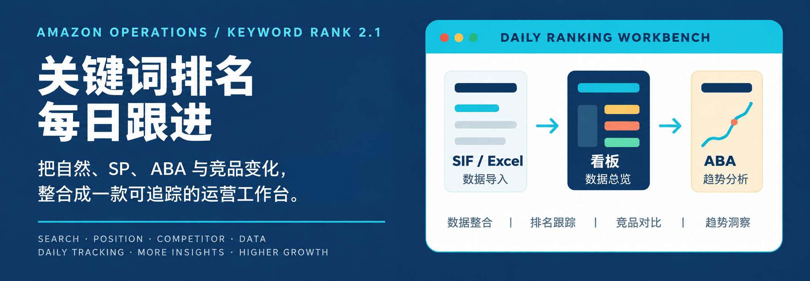

<p align="center">
  
</p>

# Amazon Operations

[简体中文](README.md) · **English**

Keyword rank tracker v2.1: a local-first workspace for daily organic rankings, sponsored product (SP) rankings, ABA trends, and competitor comparisons. The application interface is currently in Chinese.

## Latest updates — September 6, 2026

- Three clear import actions: **Import current product**, **Import all products**, and **Local import**. Automatic imports process owned products before competitors.
- Organic, SP, and comparison matrices share year and multi-select month controls. The latest month with data is shown by default. Hidden months leave no placeholder columns.
- Lighter fixed headers and a highlighted selected date improve table readability. The month menu renders on opening with a fade-in and keeps at least one month selected.
- A running K video accompanies startup. Web import loading uses a frosted background and video at 1.5× speed.
- Rank hover bubbles use a 0.5-second fade and clear on pointer exit, scrolling, and view changes.
- Import history, file tools, and settings are grouped in the web header. Restoring the previous week's backup requires typed confirmation and is unavailable without a matching backup.

## Features

- Daily dashboard, organic and SP matrices, annotations, watched keywords, and import history.
- Side-by-side organic/SP comparisons with leading relationships and ranking page indicators.
- Shared detail views for owned products and competitors, with hierarchical navigation and comparison popovers.
- Monthly ABA CSV imports and current/previous-year trends.
- Resizable columns, date and keyword filters, saved keyword combinations, custom product images, and parent ASIN editing.
- Product settings for the US, Germany, UK, Japan, Canada, France, Spain, and Italy.
- Web data stored in browser IndexedDB; desktop data stored locally through the Electron bridge.

## Import actions

| UI label | Scope |
| --- | --- |
| 导入当前产品 — Import current product | The selected owned product and its linked competitors. When viewing a competitor, its owner determines the scope. |
| 导入全部产品 — Import all products | All registered owned products, followed by all competitors. |
| 本地导入 — Local import | Manually import downloaded reports. |

Automatic SIF imports use the configured country for each product. All owned-product imports must finish before competitor imports begin. The SIF extension also supports standalone batch downloads for up to 15 ASINs.

## Use a web release

1. Extract the entire generated release folder.
2. Open `打开网页版.cmd` or `index.html` in Chrome or Edge.
3. For automatic imports, install the bundled [SIF extension](web/extensions/sif-batch-reverse-downloader/README.md) and sign in to SIF in the same browser.
4. Check product ASINs, countries, and competitor associations in Settings before importing.
5. Export a JSON backup through File Tools before moving to another browser or computer.

## Run from source

```powershell
git clone https://github.com/Changjingxiang/Amazon-Operations.git
cd Amazon-Operations
npm install
npm run dev
```

Node.js and npm are required for development. Installation also installs the application dependencies. The development command starts Vite and the Electron desktop shell.

## Build and verify

```powershell
# React/Vite production build
npm run build

# Windows x64 portable desktop application
npm run dist:win

# Build a new standalone web release
npm run release:web

# Check a generated web release
npm run verify:web -- --dir "outputs/关键词排名每日跟进网页版-v2.1"
```

Use `npm run release:web -- --output outputs/my-release` for a unique output directory. Existing release directories are not overwritten by default. Use `--force` only when intentionally replacing a release.

## Data boundaries and limitations

- `apps/keyword-rank/` is the authoritative React/Vite and Electron source. Browser-specific source lives under `web/`. Never edit generated hashed bundles under `outputs/`.
- Browser imports do not write changes back to desktop files. Use JSON backups to transfer data. Clearing site data or using private browsing may remove local web data.
- SIF imports require a signed-in session and download permissions. Downloads are also retained in the browser's Downloads folder.
- Legacy protected `asinKeywords_*.xlsx` files cannot be parsed directly by a standard browser; bundled seed data contains the existing historical records.
- Previous-week restore depends on snapshots that were actually recorded; it cannot reconstruct missing historical backups.

## Repository layout

```text
apps/keyword-rank/     React/Vite source, Electron shell, local bridges
web/browser-bridge/   Browser storage and SIF bridge
web/web-settings/     Product, competitor, ABA and matrix enhancements
web/data/             Seed data and bundled workbooks
web/extensions/       SIF browser extension
web/docs/             User guides and operating procedures
tools/                Web release and verification scripts
assets/readme/        README artwork
outputs/              Generated release artifacts, not development source
```

## Documentation

The following detailed guides are currently in Chinese:

- [Web user guide](web/docs/使用说明.md)
- [Daily operating procedure](web/docs/关键词排名每日跟进网页版-使用SOP.md)
- [SIF extension](web/extensions/sif-batch-reverse-downloader/README.md)
- [Application source guide](apps/keyword-rank/README.md)
- [SIF automatic import guide](apps/keyword-rank/SIF自动导入说明.md)
