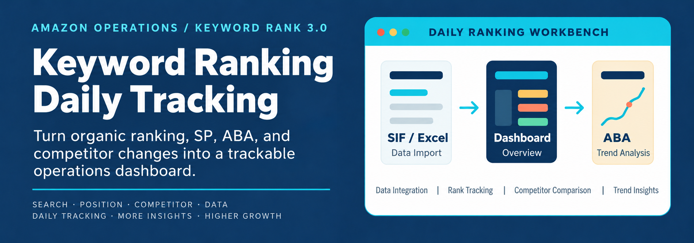

<p align="center">
  
</p>

# Amazon Operations

[简体中文](README.md) · **English**

Keyword rank tracker v3.0: a local-first workspace for daily organic rankings, sponsored product (SP) rankings, ABA trends, and competitor comparisons. The application interface is currently in Chinese.

> [!TIP]
> ## Try v3.0 online · Hosted on ChatGPT Sites
>
> **[Open the keyword tracking workspace →](https://hans-keyword-tracker.chalky-fawn-4758.chatgpt.site/)**
>
> Explore the daily dashboard, organic/SP matrices, competitor comparisons, monthly ABA rankings, and usage guide without downloading the release package. Desktop Chrome or Edge is recommended; start with the example data.

## Features

- Double-click an own-product or competitor name in the sidebar to open its Amazon product page in a new tab. Hover to see the hint; single-click still selects the product.
- Daily dashboard with an expandable keyword table, organic and SP matrices, annotations, watched keywords, and import history.
- Annotation corners preserve rank colors. Click a rank to edit a multiline note in an anchored card; save in the background without blocking other cells.
- Side-by-side organic/SP comparisons with leading relationships and ranking page indicators.
- Link one shared competitor to multiple owned products, reuse its images and history, and compare ranks and daily movement. Unlinking preserves data.
- Monthly ABA CSV imports with selectable historical years and year-over-year trends.
- Resizable columns, date and keyword filters, saved keyword combinations, hover photo previews, an expandable image history, custom product images, and parent ASIN editing.
- Product settings for the US, Germany, UK, Japan, Canada, France, Spain, and Italy.
- Web data stored in browser IndexedDB; desktop data stored locally through the Electron bridge.

## Quick start: try it online

1. Open the **[v3.0 ChatGPT-hosted site](https://hans-keyword-tracker.chalky-fawn-4758.chatgpt.site/)**. No download or local launcher is needed.
2. Use the Chinese-language usage guide and explore the example product, ranking matrices, competitors, and ABA monthly view.
3. Before using your own data, check product and marketplace settings. To migrate, export a JSON backup from your existing version and follow the migration guide.

The hosted site and a locally opened web release use separate site storage; data does not sync automatically. Use JSON backups when switching URLs, browsers, or computers. Importing a backup replaces the current data rather than merging it. Automatic SIF imports still require the extension and a signed-in SIF session in the same browser.

## Download a web release

The complete web package needs no Node.js, Python, or Codex installation. GitHub’s **Code → Download ZIP** downloads source code, not the latest ready-to-use package.

**[Download Amazon关键词每日跟进-v3.0.3.zip](https://github.com/Changjingxiang/Amazon-Operations/releases/download/web-v3.0.3/Amazon关键词每日跟进-v3.0.3.zip)** · [Release notes](https://github.com/Changjingxiang/Amazon-Operations/releases/latest)

Batch imports now end with a result dialog, including partial failures. Review errors, retry failed items, or confirm and refresh after data has been saved. Unsaved data requires a save retry or backup export before refreshing.

Before upgrading, export a JSON backup from your current version. In the annotation editor, Enter saves, Shift+Enter adds a line, and Esc cancels. Clicking outside the card also saves.

1. Extract the entire generated release folder.
2. Open `打开网页版.cmd` or `index.html` in Chrome or Edge.
3. For automatic imports, install the bundled [SIF extension](web/extensions/sif-batch-reverse-downloader/README.md) and sign in to SIF in the same browser.
4. Check product ASINs, countries, and competitor associations in Settings before importing.
5. Export a JSON backup through File Tools before moving to another browser or computer.

## Import actions

| UI label | Scope |
| --- | --- |
| 导入当前产品 — Import current product | The selected owned product and its linked competitors. When viewing a competitor, its owner determines the scope. |
| 导入全部产品 — Import all products | All registered owned products, followed by all competitors. |
| 本地导入 — Local import | Manually import downloaded reports. |

Automatic SIF imports use the configured country for each product. All owned-product imports must finish before competitor imports begin. The SIF extension also supports standalone batch downloads for up to 15 ASINs.

## Run from source

```powershell
git clone https://github.com/Changjingxiang/Amazon-Operations.git
cd Amazon-Operations
npm install
npm run dev
```

Node.js and npm are required for development. Installation also installs the application dependencies. The development command starts Vite and the Electron desktop shell.

## Build and verify

```powershell
# React/Vite production build
npm run build

# Windows x64 portable desktop application
npm run dist:win

# Build a new standalone web release
npm run release:web

# Check a generated web release
npm run verify:web -- --dir "outputs/Amazon关键词每日跟进-v3.0"
```

Use `npm run release:web -- --output outputs/my-release` for a unique output directory. Existing release directories are not overwritten by default. Use `--force` only when intentionally replacing a release.

## Data boundaries and limitations

- `apps/keyword-rank/` is the authoritative React/Vite and Electron source. Browser-specific source lives under `web/`. Never edit generated hashed bundles under `outputs/`.
- Browser imports do not write changes back to desktop files. Use JSON backups to transfer data. Clearing site data or using private browsing may remove local web data.
- SIF imports require a signed-in session and download permissions. Downloads are also retained in the browser's Downloads folder.
- Legacy protected `asinKeywords_*.xlsx` files cannot be parsed directly by a standard browser; bundled seed data contains the existing historical records.
- Previous-week restore depends on snapshots that were actually recorded; it cannot reconstruct missing historical backups.

## Repository layout

```text
apps/keyword-rank/     React/Vite source, Electron shell, local bridges
web/browser-bridge/   Browser storage and SIF bridge
web/web-settings/     Product, competitor, ABA and matrix enhancements
web/data/             Seed data and bundled workbooks
web/extensions/       SIF browser extension
web/docs/             User guides and operating procedures
tools/                Web release and verification scripts
assets/readme/        README artwork
outputs/              Generated release artifacts, not development source
```

## Documentation

The following detailed guides are currently in Chinese:

- [Web user guide](web/docs/使用说明.md)
- [Daily operating procedure](web/docs/关键词排名每日跟进网页版-使用SOP.md)
- [SIF extension](web/extensions/sif-batch-reverse-downloader/README.md)
- [Application source guide](apps/keyword-rank/README.md)
- [SIF automatic import guide](apps/keyword-rank/SIF自动导入说明.md)

## Changelog

<details>
<summary>Show recent updates</summary>

### Online site launch — September 22, 2026

- Try the [v3.0 ChatGPT-hosted site](https://hans-keyword-tracker.chalky-fawn-4758.chatgpt.site/) directly in your browser.
- The README now offers online and downloadable entry points, with backup guidance for moving between them.

### Latest updates — v3.0 · September 22, 2026

- Ships the L23M911 example product and three competitors, a 20-step contextual guide, offline SIF installation help, and JSON backup migration guidance.
- Improves watch-list saving and expanded-table management while restoring workspace context after the guide.
- This exact release keeps the legacy browser storage: saved data takes priority over example data. Export a backup before upgrading; importing replaces rather than merges current data.
- [Full v3.0 release notes](docs/releases/web-v3.0.md).

### Previous updates — v2.2 · September 21, 2026

- Double-click an owned-product or competitor name in the sidebar to open its Amazon product page in a new tab, using that product's marketplace.
- Hover displays “双击进入商品页面” (double-click to open the product page). A single click still selects the product and preserves the current matrix tab.
- Built on the v2.1 import-result fix, preserving annotations, data persistence, and batch-import results.
- The release and extracted folder are named `关键词排名每日跟进网页版-v2.2`; the download filename is `keyword-rank-web-v2.2.zip`.
- [Read the v2.2 release notes](https://github.com/Changjingxiang/Amazon-Operations/releases/tag/web-v2.2). Export a JSON backup before upgrading and import it if the new version does not display your existing data.

### Previous updates — v2.1 · September 18, 2026

- Batch imports finish with a result dialog, including partial failures, instead of remaining on the loading screen.
- View owned-product and competitor stage totals, inspect complete errors, and retry only failed items.
- Confirm and refresh after data has been saved. Unsaved data requires a save retry or backup export before refreshing.

### Previous updates — September 17, 2026

- Blue annotation corners preserve the original rank colors.
- Click a rank to open an anchored editor with keyword, date, and ranking type. Save, cancel, clear, or use Enter to save, Shift+Enter for a newline, and Esc to cancel; clicking outside also saves.
- Hover prioritizes the current annotation and rank, followed by competitor information. Hover bubbles stay hidden while editing.
- Background saving reports status on the current cell without blocking other cells; failed saves preserve the entered content.

### Previous updates — September 15, 2026

- Local Excel import persistence failures provide retry and backup-export actions.
- Startup read failures do not overwrite existing data with seed data. Main data and automatic backups report save status separately.

### Previous updates — September 7, 2026

- Shared competitor library: link one competitor to multiple owned products, reuse images and history, and import it only once. Unlinking preserves the shared record.
- Expand the dashboard keyword table and restore it with the button or Escape. Competitors support custom images.
- Fixed matrix hover keyword matching to restore ranks and annotations. Competitor bubbles show daily rank movement and entry/exit status.
- Select historical years in the monthly ABA table. Comparison rows remain together when no relationship filter is selected.

### Previous updates — September 6, 2026

- Three clear import actions: **Import current product**, **Import all products**, and **Local import**. Automatic imports process owned products before competitors.
- Organic, SP, and comparison matrices share year and multi-select month controls. The latest month with data is shown by default. Hidden months leave no placeholder columns.
- Lighter fixed headers and a highlighted selected date improve table readability. The month menu renders on opening with a fade-in and keeps at least one month selected.
- A running K video accompanies startup. Web import loading uses a frosted background and video at 1.5× speed.
- Rank hover bubbles use a 0.5-second fade and clear on pointer exit, scrolling, and view changes.
- Import history, file tools, and settings are grouped in the web header. Restoring the previous week's backup requires typed confirmation and is unavailable without a matching backup.


</details>
