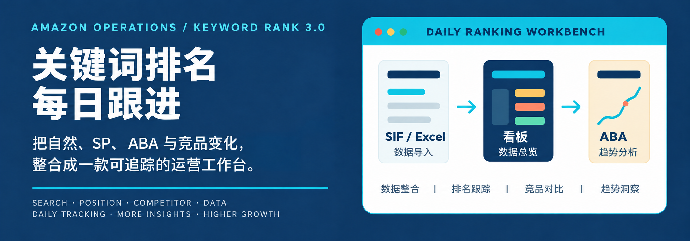

<p align="center">
  
</p>

# Amazon Operations

**简体中文** · [English](README.en.md)

> 关键词排名每日跟进 v3.0：把自然排名、SP、ABA 与竞品变化，整理成一张可追踪的运营工作台。

> [!TIP]
> ## v3.0 在线体验 · ChatGPT 站点版
>
> **[立即打开关键词跟进工作台 →](https://hans-keyword-tracker.chalky-fawn-4758.chatgpt.site/)**
>
> 无需下载发布包，打开网页即可体验：每日看板、自然/SP 排名矩阵、竞品对比、ABA 月榜与使用指南。建议在电脑端使用 Chrome 或 Edge，先用示例数据熟悉操作。

> [!IMPORTANT]
> ## 下载到本机使用
>
> **Amazon关键词每日跟进-v3.0.2-竞品图片预览版**
>
> [**点击直接下载最新版 ZIP**](https://github.com/Changjingxiang/Amazon-Operations/releases/download/web-v3.0.2/keyword-rank-web-v3.0.2.zip) · [查看更新说明](https://github.com/Changjingxiang/Amazon-Operations/releases/latest)
>
> 下载后请先“解压全部”，再双击压缩包里的 `打开网页版.cmd`。**不要用 GitHub 的 `Code → Download ZIP`**，那是源码，不是给普通用户直接打开的发布包。

<p align="center">
  <a href="https://hans-keyword-tracker.chalky-fawn-4758.chatgpt.site/">在线体验 v3.0</a> ·
  <a href="web/docs/使用说明.md">网页版使用说明</a> ·
  <a href="#快速开始">快速开始</a> ·
  <a href="web/extensions/sif-batch-reverse-downloader/README.md">SIF 扩展</a> ·
  <a href="#开发与构建">开发与构建</a>
</p>

升级前先在旧版导出 JSON 备份。新版「使用指南 → 从老版本迁移数据」会演示迁移流程；导入备份会替换当前数据，不会合并。首次使用且浏览器无已保存数据时加载随包示例。

## 先看它能做什么

- **直达商品页**：双击左侧自有产品或竞品名称，在新标签页打开对应站点的亚马逊商品页；悬停显示“双击进入商品页面”。单击仍切换产品。
- **每日跟进**：用看板总览关键词表现，在自然/SP 矩阵中追踪每日排名；关键词表格可放大查看。
- **对比决策**：按日期并列自然/SP 排名，区分“自然领先”和“SP 领先”，直接定位详情。
- **共享竞品**：一个竞品关联多个自家产品，共用图片与历史；悬停查看排名和升降，解除关联保留数据。
- **历史趋势**：按年份查看 ABA 月榜，按年月查看排名矩阵；保存关注词与标注，持续跟进重点关键词。
- **本地优先**：网页版数据保存在当前浏览器 IndexedDB，桌面版使用本地存储与文件桥接，不依赖云端账号。

## 快速开始

### 直接在线体验（推荐先看这里）

1. 打开 **[v3.0 ChatGPT 站点版](https://hans-keyword-tracker.chalky-fawn-4758.chatgpt.site/)**，无需下载或启动本地程序。
2. 从「使用指南」熟悉操作，查看示例产品的自然/SP 矩阵、竞品排名与 ABA 月榜。
3. 日常使用前检查产品与站点设置；需要从旧版本迁移时，先导出 JSON 备份，再参考「使用指南 → 从老版本迁移数据」。

在线站点与本地打开的网页版使用不同的网站存储，数据不会自动互通；更换入口、浏览器或电脑时，请使用 JSON 备份迁移。导入备份会替换当前数据，不会合并。SIF 自动导入仍需安装扩展并在同一浏览器登录 SIF。

### 使用网页版发布包

拿到上方“下载到本机使用”的完整网页版压缩包后即可使用，无需安装 Node.js、Python 或 Codex。

### 从下载到第一次导入（一步一步照做）

1. 在 [最新版发布页](https://github.com/Changjingxiang/Amazon-Operations/releases/latest) 下载 ZIP。
2. 右键 ZIP → **全部解压缩**，记住解压后的文件夹位置；不要直接在压缩包里双击。
3. 打开解压后的文件夹，双击 **`打开网页版.cmd`**。如果 Windows 弹出安全提示，选择“更多信息 → 仍要运行”。
4. 网页打开后推荐使用最新版 Chrome 或 Edge；第一次使用先到“设置 → 产品管理”检查产品、父体 ASIN 和国家。
5. 导入报表：右上角点 **“本地导入”** → 选择 Excel → 等待页面明确提示“导入成功且已保存”。
6. 按 `Ctrl+R` 刷新页面确认刚导入的日期仍在；关闭浏览器后重新打开 `打开网页版.cmd`，数据仍应保留。
7. 日常使用后到 **“工具文件夹” → “导出 JSON 备份”** 保存一份备份文件。更换浏览器、清理网站数据或使用隐私模式，都可能看不到原浏览器里的数据。

如果页面提示“数据尚未保存，刷新会丢失”，不要刷新：先点“导出当前数据”保留文件，再点“重试保存”；确认页面提示保存成功后再刷新。

需要一键 SIF 导入时，再按 [SIF 扩展说明](web/extensions/sif-batch-reverse-downloader/README.md) 加载本地扩展，并在同一浏览器中登录 SIF。

## 主要能力

### 排名与对比

- 看板顶部展示自然/SP 对比总览：共同上榜、领先关系、第一页关键词数、排名页分布和差值分布。
- 对比矩阵未选关系时合并展示，选择关系后按所选关系分区；每个日期并列显示自然排名、SP 排名，并以 ①/②/③ 标记所在页。
- 看板、自然矩阵和 SP 矩阵可查看同关键词、同日期的竞品排名、标注、周 ABA、周搜索量与流量排名。
- 支持日期筛选、关注词排序、列宽调整和父体 ASIN 修改；修改 ASIN 会保留历史、关注词、标注与产品图标。
- 自然/SP 标注保留排名涨跌颜色，以蓝色折角提示；点击排名打开就地编辑卡片，支持多行备注、Enter 保存与 Esc 取消，后台保存不打断其他单元格操作。

### 产品与数据管理

- 产品管理覆盖美国、德国、英国、日本、加拿大、法国、西班牙、意大利 8 个站点。
- 自有产品和展开列表中的竞品图片支持悬停预览、双击居中放大和历史图叠放查看；可选择简略图标或更换自定义图片。图片历史从升级后开始积累。
- 自家产品与竞品均支持内置服装图标和自定义图片；共享竞品解除关联不删除历史，即使所有关联均已解除，也可从共享库重新关联。
- 网页版工具文件夹支持导出/导入 JSON 备份、下载随包原始 Excel 和恢复上周的数据。

### 导入与自动化

- SIF 扩展可按产品国家打开反查页、下载流量词报表，并将内容回传网页版自动导入。
- **导入当前产品**：导入当前自有产品及其关联竞品；当前查看竞品时，按其归属自有产品确定范围。
- **导入全部产品**：导入全部已登记自有产品及竞品。
- 批量导入严格按“全部自有产品 → 全部竞品”执行，不交叉、不提前结束。
- 本地 Excel 导入仍可手动使用；SIF 扩展另支持单独输入最多 15 个 ASIN 批量下载。

## 数据保存与使用须知

- 网页版写入当前浏览器 IndexedDB，不会直接写回桌面文件夹；跨电脑或跨浏览器迁移请使用 JSON 备份。
- SIF 自动导入依赖同一浏览器的登录状态和下载权限；扩展仍会把文件保存在 Downloads 作为备份，不读取或修改 SIF 账号内容。
- 旧版受保护的 `asinKeywords_*.xlsx` 无法由普通浏览器直接解析；随包初始数据已包含既有历史。

## 开发与构建

以下内容面向需要修改源码或自行打包的人，需先安装 Node.js 和 npm。

### 从源码运行桌面版

```powershell
git clone https://github.com/Changjingxiang/Amazon-Operations.git
cd Amazon-Operations
npm install
npm run dev
```

`npm install` 会安装 `apps/keyword-rank` 的锁定依赖；`npm run dev` 启动 React/Vite 开发服务和 Electron 桌面壳。

### 构建、发布与验证

```powershell
# React/Vite 生产构建
npm run build

# Windows x64 portable 桌面包
npm run dist:win

# 重新构建并生成网页版发布目录
npm run release:web

# 对指定发布目录做浏览器 smoke check
npm run verify:web -- --dir "outputs/Amazon关键词每日跟进-v3.0"
```

`npm run release:web` 始终从 `apps/keyword-rank` 和 `web/` 重新构建，并生成 `outputs/关键词排名每日跟进网页版-v<版本>`。目标目录已存在时命令会安全退出；确认要替换同一版本时才使用：

```powershell
npm run release:web -- --force
```

正式源码位于 `apps/keyword-rank/`，网页专属源文件位于 `web/`。`outputs/` 仅保存生成产物，请勿直接修改其中的打包文件。

## 项目结构

```text
.
├─ apps/keyword-rank/                 # 正式 React/Vite + Electron 源码
│  ├─ src/                            # 页面、组件与数据逻辑
│  ├─ electron/                       # 桌面 IPC、本地存储与工作簿桥接
│  └─ bridge/                         # SIF / Excel 本地桥接脚本
├─ web/                               # 独立网页版发布所需源文件
│  ├─ browser-bridge/                 # IndexedDB 与 SIF 浏览器桥接
│  ├─ web-settings/                   # 产品、竞品、ABA 与矩阵增强
│  ├─ data/                            # 初始数据与随包 Excel
│  ├─ extensions/                     # SIF Manifest V3 扩展
│  └─ docs/                            # 面向使用者的说明与 SOP
├─ tools/                             # release:web / verify:web
├─ assets/readme/hero.png             # README 主 Hero（用户提供）
├─ assets/readme/hero.svg             # 可编辑 SVG 备用稿
└─ package.json
```

## 文档入口

- [网页版使用说明](web/docs/使用说明.md)：打开方式、IndexedDB 备份、产品/竞品、每日导入和月 ABA。
- [网页版使用 SOP](web/docs/关键词排名每日跟进网页版-使用SOP.md)：按日常操作顺序整理的流程。
- [SIF 扩展 README](web/extensions/sif-batch-reverse-downloader/README.md)：安装、权限、批量下载与常见故障。
- [桌面源码 README](apps/keyword-rank/README.md)：React/Vite、Electron、开发脚本和目录说明。
- [SIF 自动导入说明](apps/keyword-rank/SIF自动导入说明.md)：桌面版与网页版共用的导入约束。

## 更新记录

<details>
<summary>展开查看近期更新</summary>

### 在线站点上线（2026-09-22）

- 新增 [v3.0 ChatGPT 站点版](https://hans-keyword-tracker.chalky-fawn-4758.chatgpt.site/)：浏览器直接体验关键词跟进工作台。
- 首页提供在线体验与本地发布包两个入口，并说明跨入口的数据迁移方式。

### 最新更新 · v3.0（2026-09-22）

- 发布 Amazon关键词每日跟进-v3.0-迁移教学版-正式版，附带 L23M911 薄夹克与 3 个竞品示例。
- 提供 20 步场景教学、离线 SIF 插件安装说明和老版本 JSON 备份迁移教学。
- 优化关注词保存与放大表格中的管理操作，教学退出后恢复原有上下文。
- [查看 v3.0 完整说明](docs/releases/web-v3.0.md)。本次附件沿用旧版浏览器存储，已有数据优先读取；迁移导入会替换当前数据。

### 此前更新 · v2.2（2026-09-21）

- 左侧自有产品和竞品名称支持双击，在新标签页打开对应站点的亚马逊商品页。
- 悬停名称显示“双击进入商品页面”；单击仍切换软件内的产品，保留当前矩阵页签。
- 基于 v2.1 导入结果修复版更新，保留原有标注、数据持久化和批量导入结果功能。
- 发布名称和解压目录为“关键词排名每日跟进网页版-v2.2”，下载文件名为 `keyword-rank-web-v2.2.zip`。
- [查看 v2.2 发布说明](https://github.com/Changjingxiang/Amazon-Operations/releases/tag/web-v2.2)。升级前先导出 JSON 备份，新版未显示现有数据时再导入。

### 此前更新 · v2.1（2026-09-18）

- 批量导入结束后显示结果面板，部分失败也能正常退出加载状态。
- 显示自己产品、竞品的阶段统计和完整错误详情，支持仅重试明确失败项。
- 确认数据已保存后可点击“确定并刷新”；未确认保存时提供重试保存和导出备份，禁止直接刷新。
- 发布名称、ZIP 和解压后的文件夹统一使用“关键词排名每日跟进网页版-v2.1”。

### 此前更新（2026-09-17）

- 标注从黑底白字改为蓝色折角，保留排名数字及红/绿/灰状态颜色。
- 点击排名打开就地编辑卡片，显示关键词、日期和排名类型；支持保存、取消、清除、Enter 保存、Shift+Enter 换行与 Esc 取消，点击卡片外也会保存。
- 悬停优先展示当前标注及排名，再展示竞品信息；编辑卡片打开时隐藏悬浮提示。
- 后台保存只反馈到当前格，完成后短暂显示“已保存”；保存失败保留原内容。
- 通过实际浏览器交互、窄窗口、保存失败和本地文件刷新恢复检查。升级前请从旧版导出 JSON 备份。

### 此前更新（2026-09-15）

- 修复本地 Excel 导入的持久化反馈，写入失败时提供重试和导出入口。
- 初始化读取失败不会用初始数据覆盖已有数据，主数据与自动备份分别报告保存状态。

### 此前更新（2026-09-07）

- 共享竞品库：一个竞品可关联多个自家产品，共用图片和排名历史；解除关联保留共享数据，批量导入只处理一次。
- 看板关键词表格支持放大，点击恢复按钮或按 Esc 返回；竞品支持上传自定义图片。
- 修复矩阵气泡关键词匹配，恢复排名和标注；竞品显示相较前一天的升降名次、新上榜、掉榜或持平。
- ABA 月榜支持选择年份；对比关系全部不选时，关键词合并展示。

### 此前更新（2026-09-06）

- 导入入口简化为“导入当前产品”（包含关联竞品）、“导入全部产品”和“本地导入”；自动导入先处理自有产品，再处理竞品。
- 自然、SP、对比矩阵共享年份与月份多选下拉，默认展示最新有数据的月份；取消折叠占位，优化固定表头与日期配色。
- 月份面板打开时重新渲染，保留淡入效果；至少保留一个选中月份。
- 网页启动使用 K 跑步视频；导入加载使用毛玻璃背景及 1.5 倍速视频。
- 排名单元格悬停气泡加入 0.5 秒淡入淡出，离开、滚动和切换页面时清理。
- 网页右上角集中显示导入日志、工具文件夹和设置；恢复上周备份需要输入确认文字，没有上周备份时不会执行恢复。


</details>
